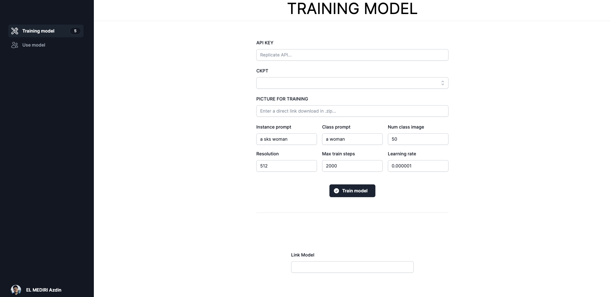

## Dashboard for Training model - DREAMBOOTH

For training a model with dreambooth in replicate, you can make one theoretically [her](https://replicate.com/replicate/dreambooth/versions/a8ba568da0313951a6b311b43b1ea3bf9f2ef7b9fd97ed94cebd7ffd2da66654) but it's not work on this web UI.  
So, i made my own dashboard for create a `output.zip` and after use this output for create picture with Stable Diffusion.  
  
You can see [DEMO](https://nextapp-one-peach.vercel.app/) of this dashboard.  

⚠️ Don't use DEMO for create training model, it's not work because i use cloud function in VERCEL with a timeout of 10 secondes. Clone and use this dashboard in your local machine.



## How create a training model

First, you need you clone this project in your computer and make following command :

```bash
npm i 
npm run dev
# or
yarn add
yarn dev
# or
pnpm i
pnpm dev
```

Open [http://localhost:3000](http://localhost:3000) with your browser to see the result.

Now you can enter a replicate API key, select CKPT you like and put a direct link download .zip where you have picture for training your model.

You select after that all parameters you need ( Instance prompt... ) and click in `Train model` and wait until in `Link Model` you get a link where you will get your model !

## How add your own CKPT Base with a direct link download

I'll explain how to add a CKPT link using the example of OpenJourney V4, which has the link : 

```bash
https://huggingface.co/prompthero/openjourney-v4/resolve/main/openjourney-v4.ckpt
```

Go to the following javascript file `app/page.js` and at the beginning of the code from line 9 to 21 you will have 2 lists where you have to add the name and the link of your CKPT link like this :  

```jsx
const people = [
    { id: 1, name: 'Analog Diffusion' },
    { id: 2, name: 'Dreamlike Photoreal 2.0' },
    { id: 3, name: 'Realistic Vision 2.0' },
    { id: 4, name: 'Realistic Vision 3.0' },
    { id: 5, name: 'OpenJourney 4.0' },
]

const CKPT = [
    { id: 1, cpkt:'https://huggingface.co/wavymulder/Analog-Diffusion/resolve/main/analog-diffusion-1.0.ckpt' },
    { id: 2, cpkt:'https://huggingface.co/dreamlike-art/dreamlike-photoreal-2.0/resolve/main/dreamlike-photoreal-2.0.ckpt'},
    { id: 3, cpkt:'https://huggingface.co/SG161222/Realistic_Vision_V2.0/resolve/main/Realistic_Vision_V2.0.ckpt' },
    { id: 4, cpkt:'https://huggingface.co/SG161222/Realistic_Vision_V3.0_VAE/resolve/main/Realistic_Vision_V3.0.ckpt' },
    { id: 5, cpkt:'https://huggingface.co/prompthero/openjourney-v4/resolve/main/openjourney-v4.ckpt' }
]
```
Finally, go to code line 103 in the `DataJson(event)` function, where you need to add your CKPT to the switch, which for me is `CKPT[4].ckpt`. Here's how it works:  

```jsx
    switch (event.target[1].value) {
        case "Analog Diffusion":
            ckptlink = CKPT[0].cpkt
            break;
        case "Dreamlike Photoreal 2.0":
            ckptlink = CKPT[1].cpkt
            break;
        case "Realistic Vision 2.0":
            ckptlink = CKPT[2].cpkt
            break;
        case "Realistic Vision 3.0":
            ckptlink = CKPT[3].cpkt
            break;
        case "OpenJourney 4.0":
            ckptlink = CKPT[4].cpkt
            break;
        default:
            ckptlink = "ERREUR"
            break;
    }
```

And that's it, you can now use CKPT for your DreamBooth face training.  

## Learn More

To learn more about this project, take a look at the following resources:

- [Next.js Documentation](https://nextjs.org/docs) - learn about Next.js features and API.
- [Replicate Documentation](https://replicate.com/docs) - Create and use Replicate API.
